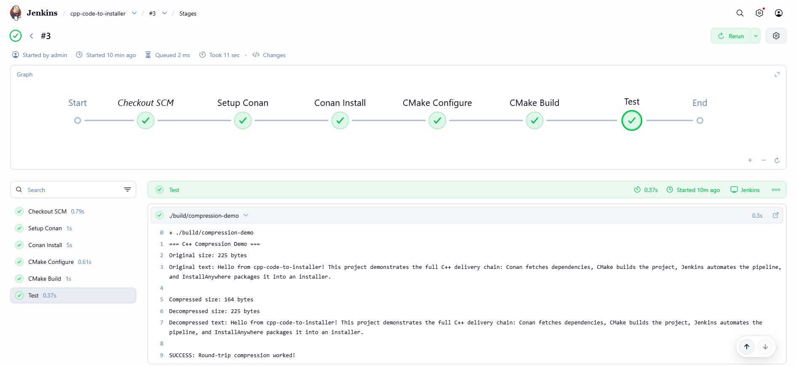

# cpp-code-to-installer

A C++ project that demonstrates the full software delivery chain: writing code, managing dependencies, automating builds, and packaging into an installer.

## What It Does

A simple compression demo app that takes a string, compresses it using zlib, decompresses it, and verifies the round-trip worked. The app itself is intentionally simple so the focus stays on the toolchain.

## The Toolchain

- **Conan** - Fetches the zlib library automatically (like pip but for C++)
- **CMake** - Wires the source files and dependencies together and tells the compiler what to build
- **Jenkins** - Automates the entire build pipeline so every push gets compiled and tested
- **NSIS** - Packages the final executable into a Windows installer with a setup wizard

## Jenkins Pipeline



The pipeline runs 5 stages automatically:
1. Setup Conan (detect compiler profile)
2. Conan Install (fetch zlib)
3. CMake Configure (set up the build)
4. CMake Build (compile everything)
5. Test (run the program and verify output)

## Project Structure

```
src/
├── main.cpp           # Entry point
├── compressor.h       # Header declaring compress/decompress functions
├── compressor.cpp     # Implementation using zlib
CMakeLists.txt         # Build configuration
conanfile.txt          # Dependency list (zlib)
Jenkinsfile            # CI pipeline definition
Dockerfile             # Custom Jenkins image with GCC, CMake, Conan
installer.nsi          # NSIS installer script
```

## How to Build

Requires GCC, CMake, and Conan installed.

```bash
conan install . --output-folder=build --build=missing
cmake -S . -B build -DCMAKE_TOOLCHAIN_FILE=build/build/Release/generators/conan_toolchain.cmake -DCMAKE_BUILD_TYPE=Release
cmake --build build
./build/compression-demo
```

## How to Create the Installer

Requires NSIS installed.

```bash
makensis installer.nsi
```

This produces `CompressionDemo-Setup.exe`.